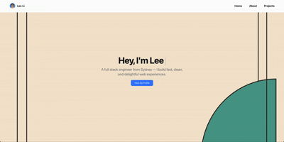

# React Portfolio Template

A modern, responsive, and customisable portfolio template built with Next.js, Tailwind CSS, and TypeScript.

I want to help developers easily create and launch their personal portfolios. This template is free to use (MIT license), whether it's for personal or commercial projects. You can have your portfolio up and running in less than 2 hours. If it helps you out, feel free to give the repo a star or report any bugs you come across!

## 🚀 Features

- Built with Next.js and TypeScript
- Styled using Tailwind CSS and shadcn-ui
- Responsive design for all devices
- Animated typing effect using `react-simple-typewriter`
- Modular and reusable components
- Easy to customise and extend

## 🌐 Live Demo

Check out the live version of this portfolio template:

👉 [https://react-portfolio-template-sage.vercel.app/](https://react-portfolio-template-sage.vercel.app/)

---

## 🖼️ Demo Screenshot

Here’s a preview of what the homepage looks like:



## 📌 TL;DR – Just Want to Try It?

Clone, install, and run locally in under 1 minute:

```bash
git clone https://github.com/4kyl-biz/react-portfolio-template.git
cd react-portfolio-template
npm install    # or yarn
npm run dev    # or yarn dev
```

Then open http://localhost:3000 in your browser and start exploring.

No config needed. Just works.

## 📦 Getting Started

### Prerequisites

Ensure you have the following installed on your machine:

- Node.js (v16 or later)
- npm or yarn

### Installation

1. **Clone the repository:**

   ```bash
   git clone https://github.com/4kyl-biz/react-portfolio-template.git
   cd react-portfolio-template
   ```

2. **Install dependencies:**

   Using npm:

   ```bash
   npm install
   ```

   Or using yarn:

   ```bash
   yarn install
   ```

### Running the Development Server

Start the development server:

Using npm:

```bash
npm run dev
```

Or using yarn:

```bash
yarn dev
```

Then open [http://localhost:3000](http://localhost:3000) in your browser to view your portfolio.

## 🛠️ Customisation

### Updating Personal Information

Modify the content in the `components` directory to reflect your personal information:

- **Navbar **: Update `components/Navbar.tsx` to change the navigation bar.
- **Hero Section**: Update `components/Hero.tsx` to change the greeting, name, and typing effect.
- **About Section**: Edit `components/About.tsx` to add your bio, skills, and profile image.
- **Projects Section**: customise `components/Projects.tsx` to showcase your work.
- **Footer**: Edit `components/Footer.tsx` to change social links and footer content.

### Changing Theme and Styles

This project uses [shadcn/ui](https://ui.shadcn.com/themes) for theming and component styling.

To update the visual style of the app:

- **Themes**: Go to [shadcn-ui Themes](https://ui.shadcn.com/themes) and pick a new theme. Replace your CSS variables in `globals.css` (or wherever your theme tokens are defined).
- **Colors & Radius**: The theme uses CSS variables like `--background`, `--foreground`, `--radius`, etc. You can customise these to change the color system or border radii.
- **Fonts**: Update fonts in `tailwind.config.js` and apply them using Tailwind utility classes.
- **Layout**: Adjust layout directly in component files using Tailwind utility classes alongside shadcn/ui components.

> 💡 Tip: To apply a new theme, just copy the CSS variables from the [Shadcn Theme Generator](https://ui.shadcn.com/themes) and paste them into your `:root` block in `globals.css`.

## 🚀 Deployment

You can deploy this portfolio using platforms like Vercel, Netlify, or GitHub Pages.

### Deploying to Vercel

1. Push your project to a GitHub repository.
2. Sign in to [Vercel](https://vercel.com/) and import your GitHub repository.
3. Follow the prompts to deploy your project.

## 📄 License

This project is licensed under the [MIT License](LICENSE). Feel free to use and modify it as per your needs.

## 🙌 Acknowledgements

This template was inspired by various open-source React portfolio templates and aims to provide a clean and customisable starting point for developers.
